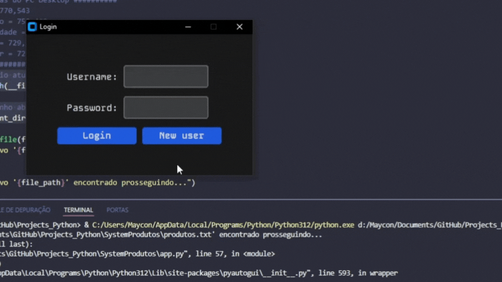

# Automação de Cadastro de Produtos em Python

## 📕 Descrição

Esta automação desenvolvida em Python realiza o cadastro de produtos em um sistema a partir de um arquivo `.txt`. O script lê os dados dos produtos e realiza o cadastro automaticamente, poupando tempo e reduzindo erros manuais.

## ⚙️ Funcionalidades

- **Leitura de Arquivo TXT**: Importa dados de produtos de um arquivo `.txt`.
- **Cadastro Automático**: Realiza o cadastro dos produtos no sistema especificado.
- **Suporte a Diversos Formatos**: Configurável para diferentes formatos de arquivo e requisitos do sistema.

## 🛠️ Como Funciona o Script

Este script automatiza o cadastro de produtos em um sistema a partir de um arquivo `.txt`. Aqui está um resumo de como ele funciona:

1. **Coleta das Coordenadas**:
   - Primeiro, identificamos as coordenadas X e Y dos elementos da interface do programa de cadastro, como o botão de login, campos de entrada e botão de registrar, usando ferramentas de captura de coordenadas.

2. **Automatização**:
   - **Leitura do Arquivo**: O script lê os dados dos produtos do arquivo `produtos.txt`.
   - **Interação com a Interface**: Utilizamos o `pyautogui` para simular cliques e digitação nos campos identificados pelas coordenadas.
   - **Cadastro dos Produtos**: Preenche os campos de nome, quantidade e preço dos produtos e finaliza o cadastro clicando no botão de registrar.

Essa automação simplifica e acelera o processo de inserção de dados, minimizando erros manuais.

## 💻 Pré-requisitos

Certifique-se de ter o Python instalado em seu ambiente de desenvolvimento. Além disso, você precisará da biblioteca `pyautogui`. Você pode instalar a biblioteca usando o seguinte comando:
> [!TIP]
> Instale o `pyautogui`
> Abra o terminal ou o cmd e digite:
> ~~~
> pip install pyautogui
> ~~~

## 🎮 Como Usar

- Clone o repositório para o seu ambiente local.
- Navegue até o diretório do projeto.
- Prepare um arquivo `.txt` com as informações dos produtos no formato especificado (veja [Formato do Arquivo](./produtos.txt)).
- Execute o script Python usando o seguinte comando:
~~~ 
python main.py
~~~
- Siga as instruções fornecidas pelo script para completar o cadastro.

## 📫 Contribuições

Contribuições são bem-vindas! Se você quiser melhorar esta automação, sinta-se à vontade para enviar um pull request.

## 🤝 Autor

- Maycon Vinicius B. Araújo - ``M4ycosoft``
  

## 🧾 Licença

Este projeto está licenciado sob a Licença MIT.
